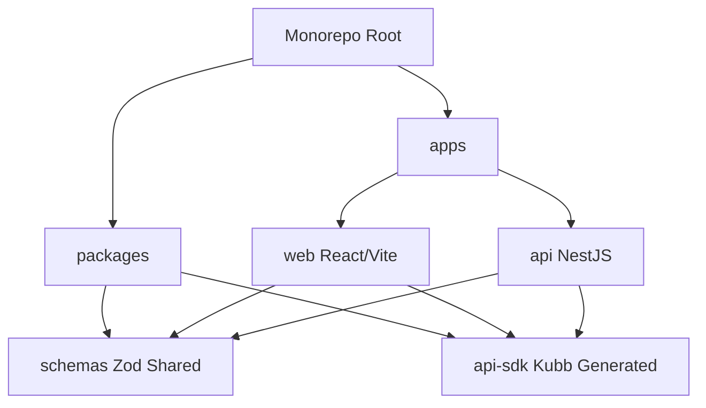

# 🏗️ System Architecture

This document provides a technical overview of the AM Dashboard architecture, highlighting the design decisions that enable scalability, type safety, and developer experience.

## 🔄 Monorepo Structure

We use **Turborepo** + **pnpm workspaces** to manage the fullstack codebase. This ensures:
- **Shared Configs:** centralized ESLint, TypeScript, and Tailwind configurations.
- **Shared Logic:** shared zod schemas used by both API and Frontend.
- **Atomic Builds:** fast CI/CD pipelines with build caching.

## 🔌 API-First Development (Kubb)

We treat the API contract (OpenAPI/Swagger) as the single source of truth.

1.  **NestJS** generates the `swagger.json` from decorators.
2.  **Kubb** reads this JSON and auto-generates:
    *   TypeScript Interfaces (`UserDto`, `AuthResponse`).
    *   React Query Hooks (`useLogin`, `useDashboardStats`).
    *   Axios Client with interceptors.

**Benefit:** If the Backend changes a field name, the Frontend build fails immediately. No more runtime errors due to mismatched types.

## 🔐 Authentication Flow (Memory-Only)

We implement a **secure JWT strategy** that protects against XSS attacks by keeping tokens out of `localStorage`:

1.  **Login:** API returns `accessToken` (JSON response) and sets `refreshToken` (long-lived) in an **HttpOnly Cookie**.
2.  **Client (Memory):** Stores `accessToken` only in **React State** (never in `localStorage`). The token is injected into Axios via a setter function.
3.  **Page Refresh:** On app mount, the client calls `/auth/refresh` to obtain a fresh `accessToken` using the persistent `refreshToken` cookie.
4.  **Interceptors:** The `@repo/api-sdk` has a centralized Axios interceptor.
    *   If a 401 occurs, it automatically calls `/auth/refresh`.
    *   If refresh succeeds, it updates the in-memory token and retries the original request.
    *   If refresh fails, it clears the token and redirects to login.

**Benefit:** Even if an attacker injects malicious JavaScript (XSS), they cannot steal the access token from memory on page refresh (unlike `localStorage`).

## 🎨 UI/UX Philosophy

The Frontend (`apps/web`) is built for performance and perceived speed:
- **Skeleton Screens:** Layout-aware skeletons prevent layout shifts (CLS).
- **Optimistic Updates:** React Query caches ensure instant navigation.
- **Staggered Animations:** Framer Motion adds polish to list items and cards.

## 🛡️ Technical Decisions

### Validation Strategy (Zod)
We use a **Unified Schema** approach.
- Schemas are defined in `@repo/schemas`.
- **Backend:** Uses `ZodValidationPipe` to validate incoming DTOs.
- **Frontend:** Uses the same schemas for React Hook Form validation.
- **Result:** Single source of truth for validation rules.

### Performance & Security
- **Rate Limiting:** Implemented via `@nestjs/throttler` to prevent abuse.
- **Strict Content Security:** All secrets are kept server-side; Frontend receives minimal configuration via env vars.
- **Reduced Motion:** Animations respect user accessibility preferences automatically.
